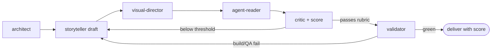

# The editorial loop

Documentation isn't written once — it's **drafted, criticized, reconstructed, and
validated**. This is the studio's internal process. The main skill orchestrates;
each role is a distinct *pass* with a narrow mandate and a **condensed return**.

## The six roles
| Role | Mandate | Produces | Must NOT |
| --- | --- | --- | --- |
| **architect** | read sources, propose IA, journeys, nav tree | Diagnosis + IA + Journeys contracts | write final prose |
| **storyteller** | turn raw content into pages (hooks, fast paths, examples) | page drafts | invent facts or decide nav |
| **visual-director** | choose visual language; approve/reject each visual | Visual plan + edits | add decoration without function |
| **agent-reader** | verify LLMs can reuse it (headings, anchors, TL;DR, contracts, copyable) | LLM-readability verdict | rewrite prose |
| **critic** | hard critique: empty marketing, unsourced claims, useless visuals, README dumps, fake depth | ranked defect list | be polite at truth's expense |
| **validator** | strict build, links, nav, dark/light, mobile, Mermaid/tabs | validation report | pass a red build |

## The loop


Order per page/section: **draft → visual → agent-read → critique+score →
reconstruct → validate.**

## Hard limits (no infinite loops)
- **At most 2–3 critique→reconstruct rounds** per page unless the user explicitly
  asks for more.
- If a page is still below threshold after the last round, **stop and report it**
  as below-threshold with the failing rubric dimensions — usually a
  [source gap](source-ledger.md), which craft can't fix.
- Each role returns a **condensed verdict** (a short list + scores), never a full
  re-edit of everything. Only the storyteller writes prose; only after the critic
  clears it does the validator run.

## Running it without sub-agents (default)
The main skill performs each role as a **sequential pass on itself**, switching
hats and keeping each pass's output to the contract format. This needs no extra
agents and is the default.

## Running it with sub-agents (available in `.agents/agents/`)
For large trees, the roles map onto six small sub-agents that return a **condensed
parecer** and never edit unbounded. They **exist** in `.agents/agents/` — invoke
them by name via the Agent tool; the main skill orchestrates and decides.

| Agent | Tools | Returns |
| --- | --- | --- |
| `docs-architect` | Read, Grep, Glob | Diagnosis + IA + Journeys contracts |
| `docs-storyteller` | Read, Grep, Glob, Edit, Write | page drafts for assigned files |
| `docs-visual-director` | Read, Grep, Edit | visual plan + surgical visual edits |
| `docs-agent-reader` | Read, Grep | LLM-readability verdict + fixes list |
| `docs-critic` | Read, Grep | ranked defect list + rubric scores |
| `docs-validator` | Read, Bash | build/link/QA report |

Only `docs-storyteller` and `docs-visual-director` edit files; the rest are
read-only. Orchestrate: architect → storyteller → visual-director → agent-reader →
critic (score) → reconstruct (loop, ≤2–3×) → validator.

Proposed frontmatter shape (example — `docs-critic`):
```yaml
---
name: docs-critic
description: Hard critique of a docs page set — flags empty marketing, unsourced
  claims, useless visuals, README dumps, and fake depth; returns a ranked defect
  list with rubric scores. Read-only; never edits.
tools: Read, Grep
---
```

**Guardrails if created:** each is small; read-mostly except storyteller/visual;
returns a condensed verdict; the main skill decides and applies. **Ask before
creating any file under `.agents/agents/`.**
