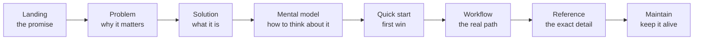

# Information architecture

How to shape a set of `.md` into a *navigable system* — the layer above any
single page. This is Step 1 (diagnose) and Step 2 (design) of the loop.

## Diagnose first (read-only)

Before proposing any structure, produce a short diagnosis. Gather with `rg`/Glob:

```bash
rg --files -g '*.md'                 # every source
rg -n '^#{1,3} ' docs/               # the current heading skeleton
rg -n '\]\(' docs/ | rg -v 'http'    # internal links (find danglers/orphans)
```

Answer, in two to five lines:

- **Audience & intent** — who reads this, what they are trying to *do*, their
  technical maturity, the journey they're on.
- **Site state** — greenfield, or an existing tree? What does `nav` look like?
- **Faults** — a checklist to scan for:

| Fault | Signal | Fix |
| --- | --- | --- |
| Orphan page | `.md` not in `nav` (or in `nav`, no file) | wire it, or delete it |
| Duplication | same fact in ≥2 pages | one home, others link |
| Weak title | filename-as-title, `README` | rename to an intent |
| Wall of text | screens of prose, no heading/list/callout | split & structure |
| Buried comparison | options described in prose | table or card grid |
| Buried process | steps described in prose | numbered list or Mermaid |
| Averaged page | one page for beginner + expert + agent | split or layer |

Write the diagnosis down. It is the contract for Step 2.

## Design by intent, not by file

Documentation navigation must answer *"what am I trying to do?"* — not mirror the
folder tree. The proven top-level shape (Codex, Databricks, Stripe all converge
here):

| Section | Reader intent | Holds |
| --- | --- | --- |
| **Get started** | "Show me it works, fast" | landing, install, quick start |
| **Guides / How-to** | "Help me do a specific task" | task-oriented walkthroughs |
| **Concepts** | "Help me understand the model" | mental models, architecture |
| **Reference** | "Give me the exact detail" | APIs, options, catalogs, tables |
| **Maintain / Operate** | "Keep it healthy over time" | ops, evolution, troubleshooting |

Not every site needs all five — but every page should belong to exactly one
intent. If you can't name the intent a page serves, it has no home yet.

## The narrative spine

Within (or across) those sections, order pages so each answers the question the
last raised — a single continuous read, wired with `navigation.footer` (prev/next):



A reader dropped anywhere should see where they are on this line and where to go
next. That is the difference between a *manual* and a *pile of pages*.

## Reader journeys

Sketch 2–3 concrete journeys and verify the IA serves each end to end:

- **The evaluator** (5 minutes): landing → problem → quick start → "is this for
  me?". Must reach a verdict without reading everything.
- **The implementer** (a work session): quick start → the specific guide → the
  reference page for exact detail → troubleshooting.
- **The agent**: landing/concept map → the page whose heading matches the task →
  copy the contract/example. Needs stable anchors and a concept index
  ([llm-readability.md](llm-readability.md)).

If a journey dead-ends or forces backtracking, the IA is wrong — fix the nav or
the links, not the prose.

## Wiring the nav

- Update `mkdocs.yml` `nav:` to the intent structure. **Labels are the map** —
  use the reader's words (`The knowledge surface & how it rots`), never a
  filename (`knowledge-surface`).
- Use `navigation.indexes` so each section has a landing `index.md`.
- Keep internal links **relative** (`../reference/api.md`) so `--strict`
  resolves them and the site is portable.
- One idea per page; if a `nav` entry needs sub-bullets three levels deep, the
  page underneath is probably several pages.

## The "choose the right file" table

A hallmark of great agent-facing docs (the Codex `.claude` directory pages): a
**routing table** near the top of a hub page that sends each reader to the right
destination by intent. Add one to every section index:

```markdown
| If you want to… | Go to |
| --- | --- |
| See it run in 30 seconds | [Quick start](quickstart.md) |
| Understand why it's shaped this way | [Concepts](concepts/index.md) |
| Look up an exact option | [Reference](reference/index.md) |
```

It costs six lines and saves every reader a wrong turn.
