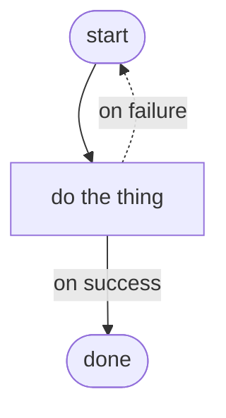

# MkDocs Material toolkit (syntax reference)

The mechanical *how* — exact syntax and the `mkdocs.yml` each element needs.
*When/why* to use them is [visual-language.md](visual-language.md). Enable an
extension **before** using its syntax, or `--strict` fails.

## Extensions — the rich superset
```yaml
markdown_extensions:
  - admonition            # !!! note / tip / warning callouts
  - attr_list             # { .class } / { #id } — cards, buttons, badges
  - md_in_html            # markdown inside <div> — needed by card grids & hero
  - tables
  - toc:
      permalink: true     # stable anchors for deep-linking (LLM-readable)
  - pymdownx.superfences: # nested fences + custom fences (Mermaid)
      custom_fences:
        - name: mermaid
          class: mermaid
          format: !!python/name:pymdownx.superfences.fence_code_format
  - pymdownx.highlight
  - pymdownx.inlinehilite
  - pymdownx.details      # ??? collapsible admonitions
  - pymdownx.tabbed:      # content tabs
      alternate_style: true
  - pymdownx.emoji:       # :material-icon: / :octicons-*: signposts
      emoji_index: !!python/name:material.extensions.emoji.twemoji
      emoji_generator: !!python/name:material.extensions.emoji.to_svg
```

## Theme features worth enabling
```yaml
theme:
  features:
    - navigation.instant          # SPA-like nav (see the document$ note below)
    - navigation.instant.progress
    - navigation.indexes          # section landing pages
    - navigation.footer           # prev/next — powers the "one read"
    - navigation.tracking
    - navigation.top
    - toc.follow
    - content.code.copy           # copy button (copyable examples)
    - content.code.annotate       # (1) inline code annotations
    - content.tabs.link           # tabs sync across the page
    - search.suggest
    - search.highlight
```

## Snippets

### Admonitions
```markdown
!!! tip "Applied tip"
    The right call depends on the stakes.

!!! warning "Don't"
    Never remove an artifact without an explicit OK.

??? note "Deep detail (collapsed by default)"
    The skimmer skips this; the curious expands it.
```
Types carry meaning: `tip` (do this) · `warning`/`danger` (risk) · `note`/`info`
(aside) · `abstract` (TL;DR) · `example` · `quote` · `success`.

### Card grid (needs `attr_list` + `md_in_html`)
```markdown
<div class="grid cards" markdown>

-   :material-rocket: **Quick start**

    ---

    First win in 30 seconds.

    [:octicons-arrow-right-24: Get started](install.md)

</div>
```

### Content tabs (needs `pymdownx.tabbed`)
```markdown
=== "macOS / Linux"
    ```bash
    make docs-serve
    ```
=== "Windows (PowerShell)"
    ```powershell
    uv run mkdocs serve
    ```
```

### Mermaid (needs the custom fence above)
````markdown

````
Renders theme-aware (light/slate). Use `flowchart`, `sequenceDiagram`,
`stateDiagram-v2`, `graph`. Keep node labels short; `<br/>` wraps lines.

### Code annotations (needs `content.code.annotate`)
````markdown
```yaml
nav:
  - Home: index.md   # (1)!
```

1.  Labels are the reader's map — make them descriptive, not filenames.
````

### Buttons (needs `attr_list`)
```markdown
[Get started](install.md){ .md-button .md-button--primary }
[GitHub](https://github.com/…){ .md-button }
```

### Badges (info bar under an H1; needs `attr_list`)
Material's built-in badge components:
```markdown
:material-check-circle:{ .mdx-badge } **Status** · stable
```
Simpler, portable version — small inline labels with a CSS class you define in
`extra.css` (e.g. `.q-badge { … }`):
```markdown
<span class="q-badge">Audience: implementer</span>
<span class="q-badge">~10 min</span>
```

### Hero (landing first-fold; needs `md_in_html` + `attr_list` + a CSS class)
```markdown
<div class="hero" markdown>

<p class="hero__eyebrow">Product · tagline</p>

# Name { .hero__title }

One-sentence promise.
{ .hero__tag }

[Get started](install.md){ .md-button .md-button--primary }

</div>
```
The `#` inside stays the real page H1 (MkDocs uses it as the title); style it and
hide its `.headerlink` via CSS. If the repo already ships a hero component, reuse
its classes instead of adding a second.

## Palette (keep the repo's)
```yaml
theme:
  palette:
    - media: "(prefers-color-scheme: light)"
      scheme: default
      toggle: { icon: material/weather-night, name: Switch to dark mode }
    - media: "(prefers-color-scheme: dark)"
      scheme: slate
      toggle: { icon: material/weather-sunny, name: Switch to light mode }
```
Always keep both schemes + the toggle — a site that only looks right in one mode
reads as broken.

## Custom CSS / JS (last resort)
Wire via `extra_css:` / `extra_javascript:` (paths relative to `docs/`). Two rules:
- **Namespace everything** (`.q-*`) so it can't leak into Material internals.
- **Instant-nav gotcha:** with `navigation.instant`, `DOMContentLoaded` fires
  once. Attach behavior through Material's observable so it re-runs per page:
  ```javascript
  document$.subscribe(function () { /* (re)initialize here */ });
  ```
- Honor `@media (prefers-reduced-motion: reduce)` for any animation.

## When to reach past Material
Almost never. Cards, tabs, admonitions, Mermaid, annotations and badges cover the
Codex-docs feel. Add CSS only for what Material genuinely can't express (a true
hero band, a stat counter). Custom code is maintenance debt — justify it first.
