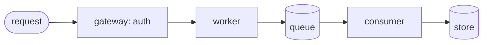

# Rewrite examples (before → after)

Teach by demonstration. Each example shows a common raw-Markdown failure and the
transform that fixes it. The *shape* transfers; the content is illustrative.

---

## 1. README → landing page
**Before**
```markdown
# my-tool
my-tool is a library that does X. Install with pip. See below for usage.
```
**After**
```markdown
<div class="hero" markdown>
<p class="hero__eyebrow">Python · data</p>
# my-tool { .hero__title }
Turn a raw CSV into a validated dataset in one call.
{ .hero__tag }
[Get started](install.md){ .md-button .md-button--primary }
</div>
```
*Why:* a promise + a path, not a topic sentence.

## 2. Long paragraph → table
**Before**
> The free tier allows 1k requests, the pro tier 100k with SSO, and enterprise is
> unlimited with a dedicated SLA and audit logs.

**After**
```markdown
| Tier | Requests | Extras |
| --- | --- | --- |
| Free | 1k | — |
| Pro | 100k | SSO |
| Enterprise | unlimited | SLA · audit logs |
```
*Why:* a comparison belongs in a grid the eye scans, not a sentence it parses.

## 3. Process in prose → Mermaid flow
**Before**
> The request hits the gateway, which authenticates it, then routes to the worker,
> which writes to the queue; a consumer later persists it.

**After**
````markdown

````
*Why:* a pipeline is seen faster than read. Keep the sentence too, for agents.

## 4. Vague section → hook + fast path
**Before**
> ## Configuration
> There are several options you can configure depending on your needs.

**After**
```markdown
## Configuration
Two settings cover 90% of setups; the rest are edge cases.

1. `api_key` — required.  2. `region` — defaults to `us-east-1`.

??? note "All other options"
    …the long list, collapsed…
```
*Why:* lead with the 90%; collapse the tail.

## 5. Human explanation → TL;DR for agents
**Before**
> This endpoint returns the user's active sessions, one object per session, and you
> can page through them with the cursor.

**After**
```markdown
!!! abstract "TL;DR for agents"
    - **GET** `/sessions` → `{ sessions: Session[], next_cursor: string|null }`
    - **Page:** pass `?cursor=<next_cursor>` until `next_cursor` is `null`.
    - **Auth:** `Authorization: Bearer <token>`.
```
*Why:* a contract an agent lifts whole, not a sentence it must parse.

## 6. Confusing list → "choose your path" cards
**Before**
> You can use the CLI, the SDK, or the REST API depending on preference.

**After**
```markdown
<div class="grid cards" markdown>
- :material-console: **CLI** — one-off tasks & scripts. [CLI →](cli.md)
- :material-language-python: **SDK** — inside an app. [SDK →](sdk.md)
- :material-api: **REST** — any language. [REST →](rest.md)
</div>
```
*Why:* three routes with intent beat one flat sentence.

## 7. Troubleshooting prose → symptom/cause/fix table
**Before**
> If you see a 401 it usually means the token expired, and a 429 means you're rate
> limited so slow down.

**After**
```markdown
| Symptom | Cause | Fix |
| --- | --- | --- |
| `401 Unauthorized` | token expired | refresh the token |
| `429 Too Many Requests` | rate limited | back off, retry with jitter |
```
*Why:* readers arrive with the *symptom* — index on it, scannably.

---

**The pattern behind all seven:** find the *shape* of the information (comparison,
sequence, routes, contract, symptom) and give it the form that shape deserves —
never leave structured information trapped in prose.
