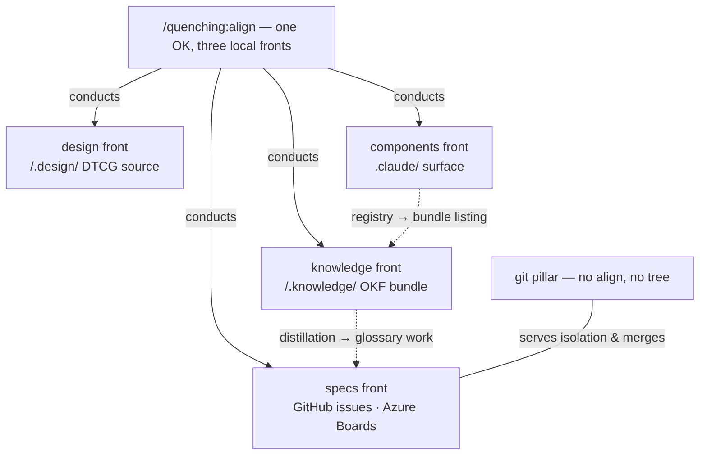

# The operating model

**If you remember one thing, make it this: every local front has exactly ONE align, and every align
probes before it plans.** The rest of the plugin — all forty-one commands — hangs off that
sentence.

A repository has four surfaces where drift accumulates, and quenching gives each one a
*front*: a namespace of commands. Three local fronts have an align that forces the surface into shape. A fifth
axis, git, is a **pillar** rather than a front — it converges no tree of its own, only answers
questions about the repository's live git state, so there is nothing a probe could find drifted
and it carries no align at all.

| Node | Namespace | Converges | Deep dive |
| --- | --- | --- | --- |
| knowledge front | `/quenching:knowledge:*` | the `/.knowledge/` OKF bundle | [The OKF bundle](okf-bundle.md) |
| specs front | `/quenching:specs:*` | provider-owned specs | [The spec lifecycle](spec-lifecycle.md) |
| design front | `/quenching:design:*` | the `/.design/` DTCG source and projections | [command catalog](../reference/commands.md#the-design-front) |
| components front | `/quenching:components:*` | the `.claude/` automation surface | [command catalog](../reference/commands.md#the-components-front) |
| git pillar | `/quenching:git:*` | nothing — answers, never converges | [command catalog](../reference/commands.md#the-git-pillar) |

## Probe-first: the interface

Every local align opens by running its front's own verifier — `cq knowledge validate`,
`cq design doctor`, `cq components doctor`/`lint` — and **stops when it finds nothing**: no
inventory, no plan, no confirmation, a couple of tool calls total. Only a drifted front pays
for the full loop: one read-only inventory → ONE consolidated plan → one OK → apply → verify.

This is why re-running an align is always safe and nearly free, and why the status commands
(`/quenching:knowledge:status`, `/quenching:design:status`, `/quenching:specs:status`) are honest dry runs: they report in
the same finding vocabulary the align would act on.

## Conductors conduct; they never reimplement

Two commands orchestrate the others, and both are bound by the same rule — **every write is
made by the command that owns it**:

- `/quenching:align` conducts the three local fronts in dependency order on one OK. Authorization
  nests one level: each front align inherits the OK and never re-asks — while anything touching
  product code, and every irreversible close, still gates on its own.
- `/quenching:specs:cycle` conducts the lifecycle of ONE spec — capture, define, build, close —
  as **two halves authorized separately**, because deciding what a spec is and deciding to
  build it are two different decisions, and no gear collapses that seam.

The same ownership rule shapes the documentation pipeline:
`/quenching:knowledge:documentation:produce` conducts plan → write → review → build, where only
`write` edits prose, `review` scores without changing a byte (eleven dimensions, bounded
rounds), and `build` owns the site layer and the strict-build gate.

## Why one interface everywhere

The bet is compounding familiarity. Learn the loop once — probe, inventory, one plan, one OK,
apply, verify — and you can predict every command you have not read yet: what it will show you
before it writes, when it will stop and ask, and what proves it worked. For an agent the same
predictability is machine-checkable: uniform `--json`, exit codes `0` ok · `1` findings ·
`2` refusal, and findings always named with the command that owns the fix.

## TL;DR for agents

!!! abstract "TL;DR for agents"
    - Map: fronts `knowledge` · `specs` · `design` · `components`; local aligns on all except provider-owned `specs`; `git` is a
      pillar, no align; `/quenching:align` conducts the three local fronts, `/quenching:specs:cycle`
      conducts one spec.
    - Interface: probe (front verifier) → read-only inventory → ONE plan → one OK → apply →
      verify; clean probe ⇒ stop.
    - Ownership: conductors never write; every write belongs to the owning command; product-code
      blast radius and irreversible closes always confirm individually.

**Next:** the tree those aligns install is [The OKF bundle](okf-bundle.md); the front with the
richest lifecycle is [The spec lifecycle](spec-lifecycle.md).
