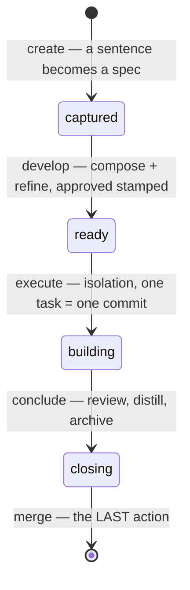

# The spec lifecycle

A spec here is not a ticket that points at the real plan somewhere else. **The issue's body IS
the plan** — one canonical markdown document for the whole lifecycle, living on the provider
your repo declared (GitHub issues or Azure Boards work items), read and written through the
`cq specs` rail. No repository specs tree, no sub-issues, no delta files: when a document
outgrows GitHub's 65,536-character body ceiling, it spills into continuation comments on its
own issue and comes back byte for byte.

## Records versus derived state

The design splits what gets *written* from what gets *computed*, and the split is the whole
philosophy: **frontmatter records human judgments; everything else is derived** from the
provider, git, and the document itself.

| Record (written once, by a human decision) | Says |
| --- | --- |
| `priority: {level, criticality, complexity, date}` | how the front ranked it |
| `refined:` | a develop pass argued with it |
| `approved: {date}` | the OK to build — the gate `execute` checks |
| `branch: {base, work}` | where isolation lives |
| `reviewed:` | the whole-branch review happened |
| `merge: {strategy, subject, pr}` | how it went home |
| `outcome: done · abandoned` | how it ended |

`ready` appears nowhere in that table because nobody writes it: it is a **derived stage**,
recomputed from the document and its records every time a command looks. A stage you cannot
hand-edit is a stage that cannot lie. Four more keys — `tags`, `assignee`, `start`, `target` —
are *state, never records*: each lives natively on the tracker (labels, assignees, scheduling
dates) and is reassembled on read, so a human's edit on the tracker IS the spec's new value.

## The life of one spec

Each transition is one command, and each writes only its own records —
[the recipe walks them](../how-to/drive-a-spec.md). Two shapes scale it: a **serial queue**
builds N approved specs over a single isolation (collisions removed by construction), a
**parallel batch** defines N raw specs at once (safe because defining writes no code). The
criterion is one line: whatever writes to the working tree serializes; whatever does not,
does not.

## Why the merge is last

Version 4.2.0 states the invariant that reordered the close: **nothing is written after the
thing it describes.** The branch review, the durable knowledge, the archive, the distillation
and the `merge:` stamp all land on the work branch — and only then does the merge happen, so
one merge carries the spec's entire footprint and nothing is ever committed to the base after
it. The task→commit anchor is the commit's *subject*, known before the commit exists, which is
what lets each task's box tick land in the same commit as its code — and lets the record
survive a rebase, since a subject outlives a rewritten sha.

## What closing gives back

A spec does not end at merged code. `conclude` runs a distillation pass: the durable rule the
work proved is written **directly into `/docs/standards/`**, honestly graded
(`authority: background` until proven, `current` once it is). There is no second store to
sync — the knowledge base and the plan cycle meet in [the same bundle](okf-bundle.md), which
is why the operating model calls the fronts mutually feeding.

!!! note "One honest caveat"
    The Azure Boards backend ships implemented but **without an end-to-end run against a real
    Azure DevOps project**. The plugin says so itself, every time: `doctor` raises
    `sp-backend-unproved`, and the first write each process prints a one-line warning.

## TL;DR for agents

!!! abstract "TL;DR for agents"
    - Unit: ONE provider-owned markdown document per spec; body = whole plan; `cq specs`
      is the only door (uniform `--json`, exit `0`/`1`/`2`).
    - Records = human judgments (`priority refined approved branch reviewed merge outcome`);
      `ready` is derived, never written; `tags/assignee/start/target` reassemble from the
      tracker on read.
    - Order at close: review → distill into `/docs/standards/` → archive → `merge:`
      stamp → merge LAST; nothing lands on base afterwards.
    - Ranked front: `cq specs next --front --table`.

**Next:** run one for real — [Drive a spec from idea to merge](../how-to/drive-a-spec.md).
