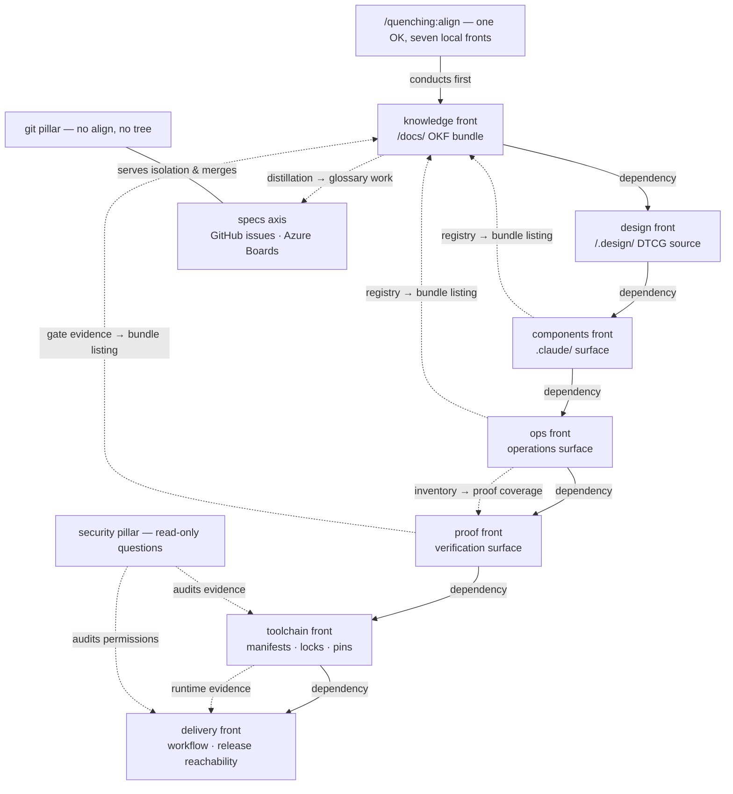

# The operating model

**If you remember one thing, make it this: every local front has exactly ONE align, and every align
probes before it plans.** The rest of the plugin's command surface hangs off that
sentence.

A repository has seven local surfaces where drift accumulates, and quenching gives each one a
*front*: a namespace of commands. The provider-owned `specs` axis has no local tree, while
`security` and `git` are **pillars** rather than fronts — they answer live questions without
owning a tree that an align converges.

| Node | Namespace | Converges | Deep dive |
| --- | --- | --- | --- |
| knowledge front | `/quenching:knowledge:*` | the `/docs/` OKF bundle | [The OKF bundle](okf-bundle.md) |
| specs axis | `/quenching:specs:*` | provider-owned specs; no local tree | [The spec lifecycle](spec-lifecycle.md) |
| design front | `/quenching:design:*` | the `/.design/` DTCG source and projections | [command catalog](../project/commands.md#the-design-front) |
| components front | `/quenching:components:*` | the `.claude/` automation surface | [command catalog](../project/commands.md#the-components-front) |
| ops front | `/quenching:ops:*` | the target repository's operations surface | [command catalog](../project/commands.md#the-ops-front) |
| proof front | `/quenching:proof:*` | the target repository's verification surface | [command catalog](../project/commands.md#the-proof-front) |
| toolchain front | `/quenching:toolchain:*` | the target repository's manifests, locks, pins and tool configuration | [toolchain align](../../plugins/quenching/commands/toolchain/align.md) |
| delivery front | `/quenching:delivery:*` | the target repository's workflow and release reachability | [delivery align](../../plugins/quenching/commands/delivery/align.md) |
| security pillar | `/quenching:security:*` | nothing — read-only security questions | [security status](../../plugins/quenching/commands/security/status.md) |
| git pillar | `/quenching:git:*` | nothing — answers, never converges | [command catalog](../project/commands.md#the-git-pillar) |

## Probe-first: the interface

Every local align opens by running its front's own verifier — `cq knowledge validate`,
`cq design doctor`, `cq components doctor`/`lint`, `cq ops doctor`, `cq proof doctor`,
`cq toolchain doctor`, `cq delivery doctor` — and **stops when it finds nothing**: no
inventory, no plan, no confirmation, a couple of tool calls total. Only a drifted front pays
for the full loop: one read-only inventory → ONE consolidated plan → one OK → apply → verify.

This is why re-running an align is always safe and nearly free, and why the status commands
(`/quenching:knowledge:status`, `/quenching:design:status`, `/quenching:specs:status`,
`/quenching:toolchain:status`, `/quenching:delivery:status`, `/quenching:security:status`) are
honest dry runs: they report in the same finding vocabulary the align would act on.

## Conductors conduct; they never reimplement

The conductor-shaped commands are bound by the same rule — **every write is made by the command
that owns it**:

- `/quenching:align` conducts the seven local fronts in dependency order on one OK. Authorization
  nests one level: each front align inherits the OK and never re-asks — while anything touching
  product code, and every irreversible close, still gates on its own.
- The provider-owned `specs` axis has no conductor: capture, definition, execution and close are
  separate commands, each with its own authorization and verification contract.

The same ownership rule shapes the documentation pipeline:
`/quenching:knowledge:documentation:produce` conducts plan → write → review → build, where only
`write` edits prose, `review` scores without changing a byte (eleven dimensions, bounded
rounds), and `build` owns the site layer and the strict-build gate.

## Why one interface everywhere

The bet is compounding familiarity. Learn the loop once — probe, inventory, one plan, one OK,
apply, verify — and you can predict every command you have not read yet: what it will show you
before it writes, when it will stop and ask, and what proves it worked. For an agent the same
predictability is machine-checkable: uniform `--json`, exit codes `0` ok · `1` findings ·
`2` refusal, and findings always named with the command that owns the fix.

## TL;DR for agents

!!! abstract "TL;DR for agents"
    - Map: local fronts `knowledge` · `design` · `components` · `ops` · `proof` · `toolchain` · `delivery`, plus
      provider-owned `specs`; `security` and `git` are pillars with no align; `/quenching:align` conducts the seven
      local fronts; the provider-owned specs axis has no conductor.
    - Interface: probe (front verifier) → read-only inventory → ONE plan → one OK → apply →
      verify; clean probe ⇒ stop.
    - Ownership: conductors never write; every write belongs to the owning command; product-code
      blast radius and irreversible closes always confirm individually.

**Next:** the tree those aligns install is [The OKF bundle](okf-bundle.md); the front with the
richest lifecycle is [The spec lifecycle](spec-lifecycle.md).
