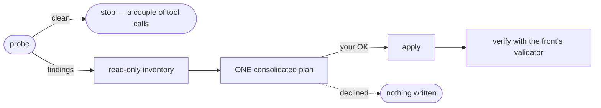

# Adopt quenching in a repository

*Audience: implementer · One OK per front*

You have a real repository — a README that grew sideways, notes in three places, a `.claude/`
folder of one-off commands — and you want it on the canonical shape without losing anything it
already has. That is exactly what the aligns are for: **convergence over accommodation**, but
never convergence over your objection.

Every align runs the same loop:



## Decide: one front, or the aligned set

| You want | Run | It converges |
| --- | --- | --- |
| Just the knowledge base | `/quenching:knowledge:align` | `/docs/` into the OKF bundle, pulling in out-of-band content |
| Just the automation surface | `/quenching:components:align` | `.claude/` onto one file per entry point, bodies audited |
| Just the design source | `/quenching:design:align` | `/.design/` source, projections, and genres |
| The whole repository | `/quenching:align` | all three local aligned fronts, dependency order, one nested OK |

!!! tip "Recommendation"
    Default to `/quenching:align` on adoption. The fronts feed each other — a spec's
    distillation is glossary work for the knowledge front; the design front's standards feed its
    projections; the automation front's registry is a
    listing the knowledge front indexes — and the conductor loops across them until nothing
    changes anywhere. Authorization nests one level: each front align inherits your OK and never
    re-asks, while a code-coupled rename and an irreversible close still gate on their own.

## Run it

1. Start from a **clean working tree** — the plan you are about to approve should be the only
   diff you end up reviewing.
2. Type `/quenching:align`. The probe runs each front's own verifier first
   (`cq knowledge validate`, `cq design doctor`, `cq components doctor`/`lint`); a clean front
   is skipped without ceremony.
3. Read the ONE plan per drifted front. It names every move: which stray docs fold into which
   `/docs/` home, which `.claude/` files collapse onto one entry point, what
   `CLAUDE.md` keeps versus what moves into the bundle.
4. Give (or decline) the OK. Anything whose blast radius reaches **product code** confirms on
   its own even inside the conducted run — one blanket OK never covers a code-coupled rename.

## What the knowledge front does beyond structure

The `docs` front is the one align with a real internal loop. After the structural pass it
offers, each on its own evidence: draining the project's Claude Code memory into the bundle,
thinning `CLAUDE.md` into a thin pointer over `/docs/`, and backfilling the glossary —
looping to a fixpoint until a pass changes nothing.

??? note "What 'converged' looks like on disk"
    The same tree in every adopted repository (a repo without data simply gets no `catalog/`):
    a root `/docs/index.md` with `okf_version: "0.1"`, a fixed `glossary.md`, and the
    homes `standards/`, `concepts/`, `external/`, `documentation/`, `vision/`, `catalog/`.
    The full anatomy is in [The OKF bundle](../explanation/okf-bundle.md).

## Verify

```bash
cq knowledge validate docs     # 0 error(s) is the gate
cq components doctor --json          # "ok": true
cq components lint --json            # zero error findings
```

Re-running an align after a green verify is cheap by design: the probe finds nothing and stops.

**Next:** with the shape in place, put real work through it —
[drive a spec from idea to merge](drive-a-spec.md).
