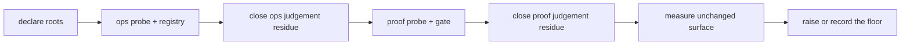

# Converge a legacy repository's operations and proof fronts

*Audience: implementer · Example: an existing Python repository with `scripts/` and `tests/`*

An old repository often has two surfaces that are real before they are declared: scripts that
people invoke and tests that CI or developers run. The safe migration order is:



The `ops` front comes first because its inventory tells the proof front which executable entry
points need coverage. The proof front comes next because a coverage floor is meaningful only after
the surface it measures is known. Neither front guesses a root, invents a layer taxonomy, arms a
write-capable script, installs CI, or runs the target suite as part of alignment.

## 1. Declare what already exists

Start in a clean target checkout and inspect the target's `.claude/quenching.json`. Declare the
operations root and its canonical router when they are known:

```json
{
  "opsRoot": "scripts",
  "router": "pyproject.toml"
}
```

Do not add `proofRoot` merely because a `tests/` directory exists. A conventional `tests/` or
`test/` directory makes the proof front applicable, but an undeclared applicable front is adoption
work: its owner must choose the proof root and gate contract. This distinction prevents an
aligner from turning an accidental directory name into a policy.

## 2. Align operations first

Run the read-only probe before reading or editing the tree:

```bash
python3 <plugin>/assets/bin/cq --root . ops doctor --json
```

Exit `0` is conformant. Exit `2` is a declaration refusal that names the missing root or router.
Exit `1` is evidence for one inventory and one plan. The operations align can regenerate a stale
registry and make bounded structural repairs. It reports judgement findings for the target owner:

| Band | Examples | Migration rule |
| --- | --- | --- |
| Mechanical | undocumented entry points, stale registry | regenerate the registry under the run authorization |
| Structural | ad-hoc roots, untyped exits, missing router | make bounded edits with the target's policy |
| Judgement | unarmed writes, disabled checks, orphan entry points | report and name the owner decision; never drive it |

After the mechanical and structural work, rerun `ops doctor` and record the remaining judgement
codes. A green registry does not make a write-capable script safe, and an orphan is not permission
to delete or archive it.

## 3. Align proof after the operations inventory

Then run:

```bash
python3 <plugin>/assets/bin/cq --root . proof doctor --json
```

Keep the same distinction between bounded repair and owner judgement. The proof align may repair
stop-first ordering, loose fixture ownership, an unmarked gate, or another explicitly structural
finding. It must report — never infer — unlayered tests, empty layers, an unmeasured surface, absent
CI, untested operations entry points, and unresolved order evidence. Use
`/quenching:proof:layer:new` when the owner is ready to choose a layer; do not create placeholder
layers just to make the doctor quiet.

The target suite remains outside this alignment pass. Run it with the repository's own supported
environment only after the static proof plan is understood, for example:

```bash
.venv/bin/python -m pytest -q
```

Record skips and environment failures separately from static findings. A test command that passes
does not prove layer ownership, CI invocation, or operations coverage by itself.

## 4. Establish the floor last

Do not raise a coverage floor while `pf-unmeasured-surface` is open or while the measured roots are
changing. First settle the proof root, layers, collection rules and gate; then measure the exact
surface; only then use the ratchet or record the achieved value:

```bash
python3 <plugin>/assets/bin/cq --root . proof ratchet --raise --json
```

If the floor is deferred, say why in the report. An absent floor is an explicit state, not a green
result.

## Measured migration example

The migration fixture for this guide was the `databricks-risco-gold` target worktree. Its existing
`scripts/` root and `pyproject.toml` router were declared, and the operations registry was
generated. The target contained 89 discovered entry points. The post-registry operations probe
reported 139 findings: 13 `op-adhoc-root`, 21 `op-untyped-exit`, 10 `op-unarmed-write`, 89
`op-orphan`, and 6 `op-disabled-check`. Those findings were retained as migration evidence; no
product scripts were mass-edited or armed.

The target also had a conventional `tests/` proof signal but no declared proof root or layer
taxonomy. Its proof probe reported 158 findings: 82 `pf-unlayered`, 62
`pf-untested-entrypoint`, 6 `pf-unmeasured-surface`, 4 `pf-loose-fixture`, and one each of
`pf-no-ci`, `pf-order-unproven`, `pf-stop-first`, and `pf-unmarked`. The target's own virtualenv
ran its suite successfully with expected skips, but that run did not close the static judgement
findings. The honest stopping point was therefore: roots and generated registries aligned, residue
reported, proof floor deferred.

## Final report

End with four explicit facts:

1. which roots and routers are declared;
2. which mechanical and structural findings were repaired;
3. which judgement findings remain, with their owner command; and
4. which measured surface produced the floor, or why the floor remains deferred.

Run `/quenching:align` again after the owner closes a judgement item. It will probe all five local
fronts in dependency order, and a front with no applicable signal reports **not applicable** rather
than inventing work.
