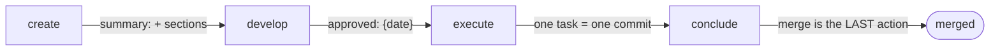

# Drive a spec from idea to merge

*Audience: implementer · Backend: GitHub or Azure Boards*

One sentence of intent becomes one canonical document on your issue tracker, and that document
carries the work to a merged branch — every human judgment recorded in its frontmatter, every
task one verified commit. This recipe drives a single spec end to end; each stage names the
command that owns it, and what it writes.



!!! note "Before you start"
    The specs front is **provider-owned**: GitHub issues or Azure Boards work items are the
    system of record, declared in `.claude/quenching.json` (`backend`, plus the project's own
    `subjects`/`tagCatalog`). A missing `gh`/`az` binary or auth is a named refusal (exit 2) on
    the first operation, never mid-build. Azure Boards ships implemented but without an
    end-to-end run against a real project — `doctor` names that gap (`sp-backend-unproved`)
    every time it is selected.

## 1. Capture — `/quenching:specs:create`

Give it a sentence, or a whole Claude Code plan file. Effort is proportional to input — a
sentence becomes `## Problem` and `summary:`, a plan file becomes every section it actually
supports, mapped and never invented. One closing screen shows what was resolved (subject, type,
tags, `complexity`) for you to correct or accept, then offers to hand straight into `develop`.

## 2. Refine and approve — `/quenching:specs:develop`

Two operations in one pass, both derived: **compose** takes the spec to a closed ready set of
sections, and **refine** argues with it — questions grouped by dependency, each with an inline
recommendation. The pass ends at the approval close, recommending approve, refine, or refine
with the premortem, against the spec's own signals. The OK to build is a stamp you can point
to: `approved: {date}` in the spec's frontmatter.

??? note "Where does 'ready' live?"
    Nowhere — and that is the point. `ready` is a **derived** stage, computed from the document
    and its records; frontmatter records only human judgments (`priority`, `refined`,
    `approved`, `branch`, `reviewed`, `merge`, `outcome`). See
    [The spec lifecycle](../explanation/spec-lifecycle.md) for the full record vocabulary.

## 3. Build — `/quenching:specs:execute`

Requires a clean tree; when it starts from the base branch it offers isolation inline — a real
git branch or worktree, recorded as `branch: {base, work}`. Then the loop, task by task:
write → run the task's `verify:` under the spec's declared policy → four-item diff self-review
→ tick the box **with the subject of the commit it is about to make**, so code and tick land in
ONE commit. Progress is visible from any session:

```bash
cq specs next --front --table    # the ranked front, one Summary line per spec
```

A finding that does not belong to the current task is one `cq specs discover` line, not a
detour. The command stops at the last commit — closing is a different decision.

## 4. Close — `/quenching:specs:conclude`

Closing is where the plugin is most opinionated: **nothing is written after the thing it
describes, so the merge is last.** On the work branch, in order: the whole-branch review
(`reviewed:`), the durable knowledge the work earned — written into `/docs/standards/`,
honestly authority-graded — the archive with `outcome: done` (open boxes refuse unless forced)
or `abandoned` (always allowed), one distillation pass, any release obligations your standards
attach to the merge, and the `merge: {strategy, subject, pr}` stamp. Only then the merge
itself, by the route you chose: local, or a pull request. Nothing lands on the base after it.

!!! success "You should end with"
    - the spec archived on the tracker with `outcome: done`;
    - one merged branch whose per-task subjects resolve on the base;
    - any durable rule the work proved, sitting in `/docs/standards/` — not in a wiki.

## Scaling beyond one spec

| You have | Run | Shape |
| --- | --- | --- |
| One spec, whole lifecycle | `/quenching:specs:cycle` | conductor: two halves, two authorizations |
| N approved specs to build | `/quenching:specs:execute-queue` | serial queue over a single isolation, one conclude |
| N raw specs to define | `/quenching:specs:develop-batch` | parallel batch — nothing writes, so it fans out for real |

**Next:** the reasoning behind records-versus-derived-state is in
[The spec lifecycle](../explanation/spec-lifecycle.md); every command's one-line contract is in
the [command catalog](../project/commands.md).
