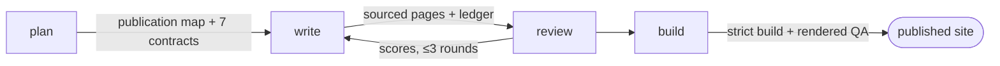

# Publish the documentation site

*Audience: implementer · Generator: Zensical · Gate: strict build + rendered checks*

Your `/docs/` bundle holds the truth; this pipeline turns it into a site a newcomer can
actually read — and refuses to call a hollow site done. Four stages, each owned by one command,
each handing evidence (never vibes) to the next:



## The two ways to run it

=== "Conducted (recommended)"

    ```text
    /quenching:knowledge:documentation:produce
    ```

    One authorization, four stages in order, one final report: coverage over the **whole
    bundle** (`covered / mandatory mapped × 100`), build result, QA mode and every open gap.

=== "Stage by stage"

    ```text
    /quenching:knowledge:documentation:plan      # diagnose + publication map + one OK
    /quenching:knowledge:documentation:write     # sourced pages from the plan
    /quenching:knowledge:documentation:review    # scores; changes not a byte
    /quenching:knowledge:documentation:build     # site layer, strict build, rendered QA
    ```

    Useful when iterating on one stage — the plan of record persists at
    `.quenching/documentation/plan.md`, outside the docs tree.

## What makes a plan acceptable

The plan is not a page list — it is a **closed coverage contract**. Its publication map decides
every source home explicitly: `publicar`, `publicar derivado`, or `não publicar` with a reason.
Coverage is then measured against every mandatory row, not against the pages one pass happened
to select — a page you wrote cannot hide a home you forgot.

| Decision | Meaning | Example |
| --- | --- | --- |
| `publicar` | the home's pages ship as-is under the site | `documentation/` itself |
| `publicar derivado` | the source stays outside `docs_dir`; a generated projection ships | root glossary → `reference/glossary.md` |
| `não publicar` | an explicit editorial exclusion, with motive | internal `standards/` |

## The glossary is default-on

A populated root `glossary.md` publishes by default; only an explicit `não publicar` row
overrides that. The projection is generated — never hand-maintained — and provable:

```bash
cq knowledge project docs --write   # materialize the abbreviation snippet
cq knowledge project docs --check   # prove the projection hash and origin
```

Re-running `--write` on an unchanged source is a byte-identical no-op. On every page of the
built site, glossary terms render as `<abbr>` tooltips via the generated abbreviation snippet
— one canonical term list, projected everywhere.

## Build and prove it

```bash
python3 <plugin>/assets/bin/cq knowledge site-source docs site-source --write
uv run zensical build --clean --strict
python3 <plugin>/assets/checks/documentation-site-check.py site --local \
  --require-glossary --glossary-source docs/glossary.md \
  --glossary-snippet site-source/assets/glossary-abbreviations.txt \
  --glossary-route glossary.md
```

(`<plugin>` is the quenching plugin root; inside a session the command bodies resolve it as
`${CLAUDE_PLUGIN_ROOT}` — in a plain shell that variable is empty, so spell the path out.)

The strict build fails on broken links and unresolved references; the site checker runs
**always, immediately after every build** — even a green one — and proves what a build cannot:
assets present, anchors resolving, sitemap well-formed, no orphan pages, no remote resources,
and a known glossary term actually rendered as `<abbr>`. For a local-only config, add
`--local`; a local artifact is never reported as an external deployment.

!!! warning "What the gate refuses"
    A page below the quality threshold is reported with its failing dimensions — not silently
    shipped. Internal markers (`TODO`, planning contracts, ledger notes) never cross into a
    published page; they live in `.quenching/documentation/`. And a claim without a source
    becomes `source gap:` in the ledger — softened or cut, never invented.

## TL;DR for agents

!!! abstract "TL;DR for agents"
    - Contract: plan → write → review (≤3 rounds) → build; plan-of-record at
      `.quenching/documentation/plan.md`; publication map is the closed coverage denominator.
    - Prove: `cq knowledge project … --check` (glossary projection) and
      `documentation-site-check.py <site_dir>` after **every** build.
    - Never: hand-edit generated routes/snippets; link `/docs/` paths from published
      pages; run `zensical serve` unattended; commit `site/`.

**Next:** how the conductor fits the plugin's wider ownership rules is in
[the operating model](../explanation/operating-model.md); exact command signatures are in the
[command catalog](../project/commands.md).
