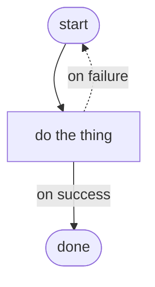

# Documentation visual language — useful components and exact syntax

The semantic choice and the mechanical Zensical syntax for cards, tabs, Mermaid, badges,
heroes, tables and callouts. Components are information-bearing, not decoration.

## Contents

`cq components read ../../references/knowledge-documentation/visual.md`
returns the heading index; `--sections <name>` addresses one.

<!-- rules -->

## Choose the form by content

| The content is… | Use | Not |
| --- | --- | --- |
| A comparison of options | table / decision matrix | prose |
| A sequence of steps | numbered list or Mermaid flow | prose |
| A branching process / architecture | Mermaid graph | ASCII wall |
| Pick your path (2–4 routes) | card grid | flat bullets |
| Same task, different scenario | content tabs | repeated sections |
| Risk, tip, decision or tradeoff | admonition | buried sentence |
| Deep detail | collapsible `???` | inline wall |
| Status, audience, difficulty or time | badge | a sentence |
| First fold of a landing | hero | plain H1 |

Every visual carries information or is cut. Use one semantic icon per card or section and keep a
consistent vocabulary. Mermaid stays at roughly five to nine nodes, labels actions on edges, and
mirrors critical facts in text. Images are proposed first and vendored locally; Mermaid or CSS is
preferred for flows and hero treatments.

## Extensions — the rich superset

```toml
[project.markdown_extensions]
  admonition                         = {}
  attr_list                          = {}
  md_in_html                         = {}
  tables                             = {}
  toc.permalink                      = true
  pymdownx.details                   = {}
  pymdownx.highlight                 = {}
  pymdownx.inlinehilite              = {}
  pymdownx.tabbed.alternate_style    = true
  pymdownx.emoji.emoji_index         = "zensical.extensions.emoji.twemoji"
  pymdownx.emoji.emoji_generator     = "zensical.extensions.emoji.to_svg"
  pymdownx.superfences.custom_fences = [
    { name = "mermaid", class = "mermaid", format = "pymdownx.superfences.fence_code_format" },
  ]
```

Same Python-Markdown as before, so the extensions carry over; in TOML the `!!python/name:` values
are plain strings, and the emoji index moves to the theme's own `zensical.extensions.emoji`.

## Theme features

```toml
[project.theme]
  features = [
    "navigation.indexes",
    "navigation.footer",
    "navigation.tracking",
    "navigation.top",
    "toc.follow",
    "content.code.copy",
    "content.code.annotate",
    "content.tabs.link",
    "search.highlight",
  ]
```

The search engine is a new implementation: `search.highlight` exists, `search.suggest` has no
equivalent, and the search interface is English-only for now.

## Syntax snippets

### Admonitions

```markdown
!!! tip "Applied tip"
    The right call depends on the stakes.

!!! warning "Don't"
    Never remove an artifact without an explicit OK.

??? note "Deep detail (collapsed by default)"
    The skimmer skips this; the curious expands it.
```

### Card grid

```markdown
<div class="grid cards" markdown>

-   :material-rocket: **Quick start**

    ---

    First win in 30 seconds.

    [:octicons-arrow-right-24: Get started](install.md)

</div>
```

### Content tabs

```markdown
=== "macOS / Linux"
    ```bash
    python3 -m zensical build --clean --strict
    ```
=== "Windows (PowerShell)"
    ```powershell
    python -m zensical build --clean --strict
    ```
```

### Mermaid

````markdown

````

### Code annotations

````markdown
```yaml
nav:
  - Home: index.md   # (1)!
```

1. Labels are the reader's map — make them descriptive, not filenames.
````

### Buttons, badges and hero

```markdown
[Get started](install.md){ .md-button .md-button--primary }

<span class="q-badge">Audience: implementer</span>
<span class="q-badge">~10 min</span>

<div class="q-hero" markdown>
<p class="q-hero__eyebrow">Product · tagline</p>
# Name { .q-hero__title }
One-sentence promise.
{ .q-hero__tag }
[Get started](install.md){ .md-button .md-button--primary }
</div>
```

The real H1 stays inside the hero. `extra_css` wires the `.q-badge` and hero classes. Keep both
light and dark palettes with a toggle:

```toml
[[project.theme.palette]]
  media       = "(prefers-color-scheme: light)"
  scheme      = "default"
  toggle.icon = "material/weather-night"
  toggle.name = "Switch to dark mode"

[[project.theme.palette]]
  media       = "(prefers-color-scheme: dark)"
  scheme      = "slate"
  toggle.icon = "material/weather-sunny"
  toggle.name = "Switch to light mode"
```

<!-- rationale -->

The extension must be enabled before the syntax appears in a page. Namespace custom CSS with
`.q-*`, use the theme's own `--md-*` variables for colors, and turn off animations under
`prefers-reduced-motion: reduce`.
